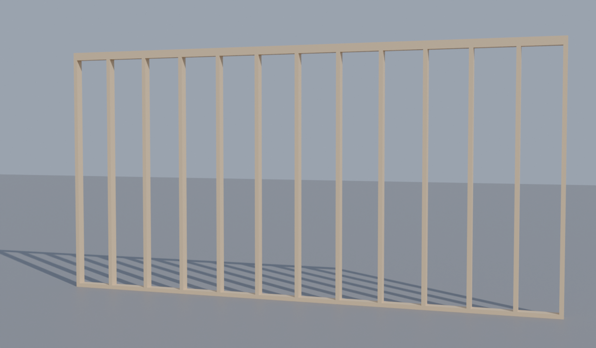

# Blender Bridge for Claude

Lets a Claude Code session on **your own computer** see and control Blender.

```
Claude Code ──MCP (stdio)──► mcp_server.py ──TCP 127.0.0.1:9876──► Blender add-on
```

| File | Runs in | Job |
|------|---------|-----|
| `addon/claude_bridge.py` | Blender | Local socket server; runs requests on Blender's main thread |
| `mcp_server.py` | Your terminal (started by Claude Code) | Exposes Blender to Claude as MCP tools |

## Setup (once)

**Quick way.** Quit Blender, then in Terminal:

```bash
git clone https://github.com/cristyandavid/David-s-.git && cd David-s-/blender-bridge
./setup.sh
```

This creates a Python venv with `mcp`, installs and enables the add-on, and
registers the `blender` MCP server with Claude Code. It's safe to re-run. If
Blender isn't in `/Applications`, run it as `BLENDER=/path/to/Blender ./setup.sh`.

**Manual way:**

1. **Install the add-on** — Blender → Edit → Preferences → Add-ons → Install… →
   pick `addon/claude_bridge.py` → tick **Claude Bridge**. (Blender 4.2+: use
   the dropdown → *Install from Disk*.)
2. **Install the MCP package** — `pip install mcp` (Python 3.10+). Both mcp 1.x and 2.x work.
3. **Register the server with Claude Code**:
   ```bash
   claude mcp add blender -- python /full/path/to/blender-bridge/mcp_server.py
   ```

## Each session

1. In Blender's 3D viewport press **N** → **Claude** tab → **Start Claude Bridge**.
2. Start Claude on the same machine: `claude` in a terminal, or
   `claude remote-control` to drive it from the Claude app on your phone/web.
3. Ask: *"Ping Blender"*, then try the example: *"Run examples/stud_wall.py in Blender."*



`examples/stud_wall.py` builds a 16 ft 2×4 wall at 16 in. on center (13 studs,
a bottom plate and a double top plate) and renders it. Edit the numbers at the
top of the file, or just ask Claude for a different size.

`examples/wall_with_openings.py` builds the wall as it goes up on site: studs
at 16 in. on center, a door and a window with king and jack studs, doubled 2x10
headers, a sill and cripples, then 4x8 rigid foam on the outside, vertical
strapping and trim round the openings. Set the wall size and the openings in
the `OPENINGS` list at the top. `FOAM` and `STRAPPING` switch the outer layers
off. Run headless in Blender 5.0 (`pip install bpy`) together with
`site_anchors.py` and `export_ar.py`; not yet run through the live bridge.

## AR / XR

Three scripts take a model from Blender to the job site:

| Step | Script | What it does |
|------|--------|--------------|
| 1 | `examples/stud_wall.py` (or your own model) | Build it |
| 2 | `examples/site_anchors.py` | Adds control points **CP_A** and **CP_B** on the layout line (for a wall, the chalk line along the bottom plate), at any wall angle. Move them in Blender to any two points you can find on site |
| 3 | `examples/export_ar.py` | Exports at real-world scale, with CP_A as the origin and CP_A→CP_B along +X |

Ask Claude *"run site_anchors.py then export_ar.py in Blender"*. Files go to your Desktop:

| File | Opens on |
|------|----------|
| `.usdz` | iPhone, iPad, Vision Pro: tap it in Files or Messages. The tap point is CP_A |
| `.glb` | Android, Meta Quest, web viewers; Unity via the glTFast package |
| `.fbx` | Unity. **For on-site alignment to your real marks, see [`../unity/README.md`](../unity/README.md)** |

Ready-made stud wall files, with control points, are in [`examples/ar/`](examples/ar/).
On an iPhone or iPad, open `stud_wall.usdz` on GitHub, tap **Download**, and open
it from Files to see the 16 ft wall full size.

## Tools Claude gets

| Tool | What it does |
|------|--------------|
| `ping` | Checks the bridge is up |
| `get_scene_info` | Objects, transforms, materials, render engine |
| `get_object_info(name)` | Dimensions, modifiers, materials, mesh stats |
| `execute_blender_code(code)` | Runs Python in Blender (`bpy` pre-imported). Set `result = ...` to return a value |

## Settings

Environment variables for `mcp_server.py`: `BLENDER_BRIDGE_HOST` (default
`127.0.0.1`), `BLENDER_BRIDGE_PORT` (default `9876`, match the port in the
Claude tab), `BLENDER_BRIDGE_TIMEOUT` (seconds, default `130`).

## Security

`execute_blender_code` runs **any Python** with your user's permissions — it can
read, write and delete files. The add-on only listens on localhost and is off
until you click Start. Stop the bridge when you're done, and keep Claude Code's
permission prompts on for this tool.

## Troubleshooting

- **"Blender is not listening"** — the bridge isn't started, or the port differs.
- **"Could not start bridge: Address already in use"** — change the port in the
  Claude tab and set `BLENDER_BRIDGE_PORT` to match.
- **Long operations time out** — the add-on waits up to 120 s per request.
  Raise `JOB_TIMEOUT` in `claude_bridge.py`, and keep `BLENDER_BRIDGE_TIMEOUT`
  a little higher than it.
